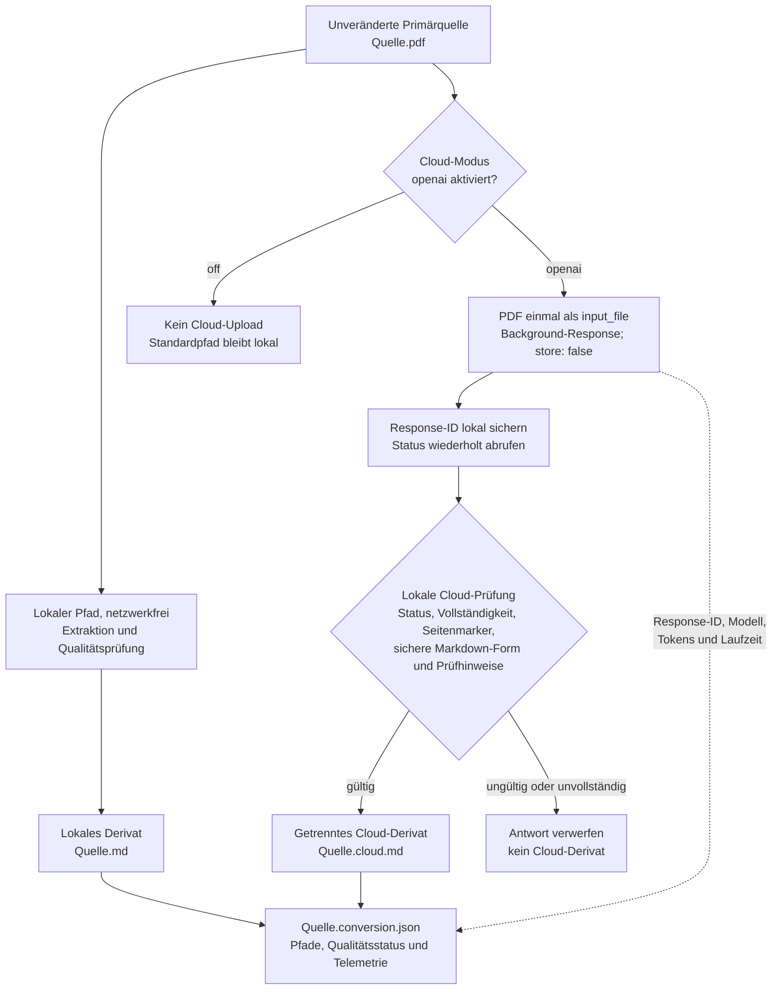
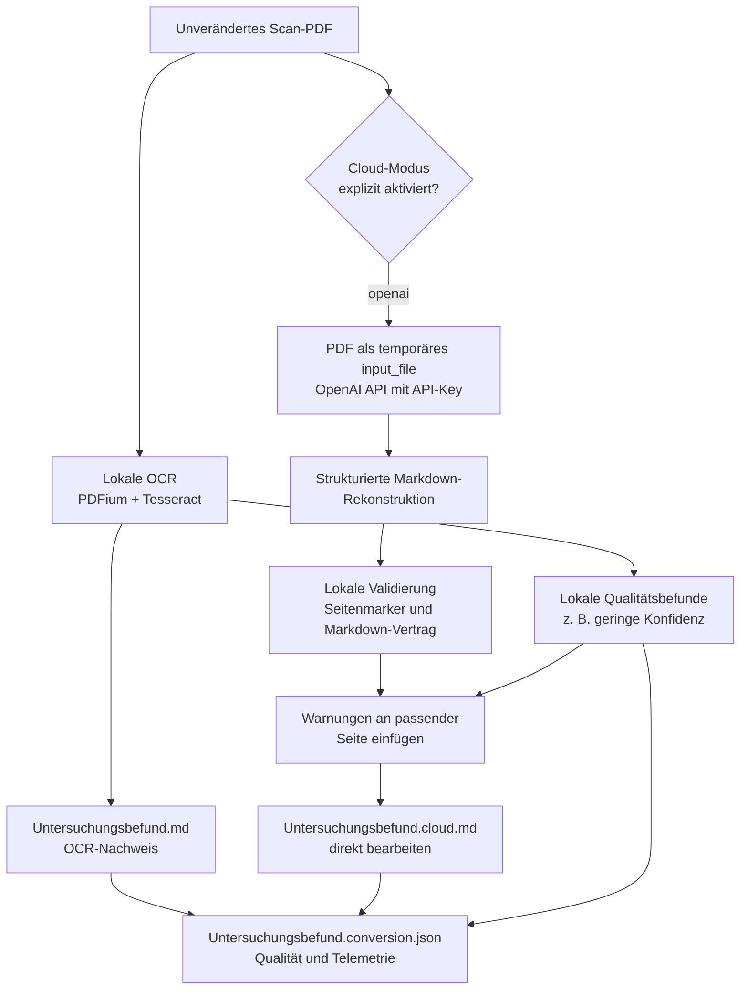

# DocToMD

DocToMD ist eine lokale Python-Engine, die digitale, textbasierte PDFs in
strukturiertes Markdown mit Seitenbezug überführt. Die MVP-Pipeline schreibt
Markdown, ein Konvertierungsmanifest und sichtbare Qualitätswarnungen.

## Voraussetzungen

- Python 3.12 für Entwicklung und CI
- Python 3.11 oder neuer für unterstützte Laufzeiten

## Entwicklungsstart

In PowerShell im Projektordner:

```powershell
python -m venv .venv
.\.venv\Scripts\python.exe -m pip install -r requirements.txt
.\.venv\Scripts\python.exe main.py
```

Die aktuelle CLI zeigt ohne Argumente ihre Hilfe. Der definierte Konvertierungsaufruf lautet:

```powershell
.\.venv\Scripts\python.exe main.py convert "<input.pdf>" --output-dir "<zielordner>"
```

Ein vollständiges, lokales Beispiel mit der JSON-Antwort und dem erzeugten Manifest steht in [[CLI_MANIFEST_EXAMPLE|CLI- und Manifestbeispiel]].

Das Ausgabeformat ist derzeit explizit auf `markdown` festgelegt und kann mit `--output-format markdown` angegeben werden. Für vorhandene abgeleitete Artefakte gilt sicherheitsorientiert `--on-conflict error`; `update` und `overwrite` sind opt-in und werden mit der Artefaktverwaltung umgesetzt.

## Bilder und editierbare Bildbeschreibungen

Für jedes tatsächlich exportierte Bild erzeugt DocToMD im zugehörigen `Quelle.assets`-Ordner eine gleichnamige Sidecar-Note, zum Beispiel `page-005-figure-01-description.md`. Die Haupt-Note enthält neben dem Bild einen Link „Bildbeschreibung bearbeiten“. Die editierbare Vorlage trennt Kurzbeschreibung, fachliche Einordnung, sichtbare Details und Unsicherheiten; Original-PDF und Bilddatei bleiben unverändert. Der vollständige Ablauf steht in [[IMAGE_DESCRIPTION_WORKFLOW|Workflow für Bildbeschreibungen]].

Der eingegebene Text bleibt in dieser Sidecar-Note. DocToMD übernimmt ihn nicht automatisch als Bildunterschrift oder Alt-Text in `Quelle.md` beziehungsweise `Quelle.cloud.md`, und eine erneute Konvertierung überschreibt eine bereits vorhandene Beschreibungs-Note nicht. DocToMD erstellt keinen RAG-Index: Soll der Beschreibungstext recherchierbar sein, muss der konsumierende Indexer neben der Haupt-Note auch `Quelle.assets/**/*.md` einbeziehen.

## Fortschritt für CLI und Obsidian

`convert` meldet seinen Fortschritt getrennt vom Ergebnis. Die finale menschen- oder maschinenlesbare Ergebnisantwort bleibt auf `stdout`; Fortschrittsereignisse erscheinen ausschließlich auf `stderr`. Damit bleibt `--json` ein einzelnes gültiges JSON-Dokument.

```powershell
.venv\Scripts\python.exe main.py convert "D:\Pfad\Quelle.pdf" --output-dir "D:\Pfad\Ausgabe" --progress human
```

`--progress human` ist der Standard und zeigt Zeit sowie verständliche Phasen. `--progress jsonl` schreibt je Fortschrittswechsel eine JSON-Zeile mit `schema_version`, `event: "progress"`, `phase`, `status`, `message` und `elapsed_ms`; `--progress none` unterdrückt die Anzeige. Die Phasen sind `prepare`, `extract`, `ocr`, `assets`, `structure`, `cloud` und `write`. Für Cloud-Läufe sind nur die belegbaren Status `queued`, `in_progress` und `completed` verfügbar. Eine Prozentzahl wäre irreführend und wird deshalb nicht angezeigt.

Ein späteres Obsidian-Plugin startet DocToMD als Kindprozess, liest `stderr` zeilenweise und ordnet die JSONL-Phasen einem Fortschrittsdialog zu. Es liest die finale Antwort ausschließlich von `stdout`, zeigt bei `cloud/queued` und `cloud/in_progress` einen unbestimmten Fortschritt mit Laufzeit und verwendet bei `cloud/resuming` denselben Dialog weiter. Ein Abbrechen-Knopf ist ein separater nächster Schritt: Er muss eine gespeicherte Response-ID gezielt über die OpenAI-API abbrechen und darf niemals durch Löschen lokaler Artefakte simuliert werden.

Für die Ablage im Vault verwendet ein separates Plugin je Quelle einen eigenen Ausgabeordner und behandelt die darin erzeugten Namen als stabilen Vertrag. Die konkrete Konvention, Konfliktbehandlung und Öffnungsregel stehen in [[OBSIDIAN_VAULT_OUTPUT_CONVENTIONS|Ausgabeordner und Namenskonventionen für Obsidian-Vaults]].

OCR arbeitet lokal über Tesseract 5. `--ocr-mode auto` verwendet den Fallback nur bei PDFs ohne extrahierbaren Textlayer, `off` unterbindet ihn und `force` verlangt ihn für alle Seiten. Die erste OCR-Stufe unterstützt `de` beziehungsweise `de-DE` sowie `en` beziehungsweise `en-US`; dafür müssen die Tesseract-Sprachdaten `deu` beziehungsweise `eng` installiert sein. Seiten werden ausschließlich im Arbeitsspeicher mit PDFium gerendert; die Primärquelle bleibt unverändert.

`--ocr-pages all` ist der Standard; eine gezielte Auswahl wie `--ocr-pages 1-3,5` beschränkt den OCR-Lauf auf diese einsbasierten Seiten. `--ocr-min-word-confidence 0-100` setzt die Warnschwelle für die mittlere, aus Tesseract-TSV gelesene Wortkonfidenz und hat den Standardwert `70`. Werte unterhalb dieser Grenze erzeugen die seitenbezogene Warnung `OCR_LOW_CONFIDENCE`; sie werden nicht korrigiert oder ergänzt.

Die Vision-Schnittstelle ist bewusst standardmäßig deaktiviert: `--vision-provider none --vision-mode off`. Ein expliziter Provider kann mit `--vision-provider lm-studio|openai`, `--vision-mode off|auto|force`, `--vision-model`, `--vision-render-dpi` und `--vision-timeout-seconds` konfiguriert werden. `--lm-studio-endpoint` ist ausschließlich für LM Studio zulässig. `auto` und `force` benötigen eine Modell-ID; ein tatsächlicher Vision-Aufruf folgt erst mit dem nächsten Verarbeitungsschritt. Für den späteren Provider `openai` wird der Schlüssel ausschließlich als Umgebungsvariable `OPENAI_API_KEY` gelesen und niemals als CLI-Option, im Manifest oder in einer Konfigurationsdatei gespeichert.

Schon jetzt plant `auto` ausschließlich Seiten mit lokalen, seitenbezogenen Qualitätsrisiken für einen späteren Vision-Schritt. Dazu zählen Mehrspaltenlayout, nicht dekodierbare Zeichen, nicht rekonstruierbare Formeln sowie unsichere Tabellen- und Bildstrukturen. Der JSON-Ergebnisbereich `result.vision_pages` zeigt diese Auswahl. `force` plant alle Seiten; `off` und `none` planen keine. Die aktuelle Auswahl rendert keine Seitenbilder und ruft kein Netzwerk auf.

Vorschläge eines späteren Vision-Providers müssen dem providerneutralen, versionierten Vertrag [`schemas/vision-proposal-1.0.schema.json`](schemas/vision-proposal-1.0.schema.json) entsprechen. Er enthält ausschließlich Vorschläge für eine Seite mit Absätzen, Formeln, Tabellen und Captions samt Seitenbezug und Konfidenz. Die lokale Validierung entscheidet erst im folgenden Schritt, ob ein Vorschlag verwertbar ist.

Die lokale Validierung verwirft eine gesamte Vision-Antwort, wenn sie nicht dem Vertrag entspricht, eine andere Seite nennt, die Konfidenz unterschreitet oder Tabellen beziehungsweise Formelquelltext nicht lokal prüfbar sind. Sie erzeugt dann seitenbezogene Warnungen wie `VISION_INVALID_JSON`, `VISION_LOW_CONFIDENCE` und `VISION_UNVERIFIABLE_CONTENT`. Adapterfehler werden als `VISION_BACKEND_UNREACHABLE` beziehungsweise `VISION_TIMEOUT` sichtbar. Kein abgewiesener Vorschlag verändert Markdown oder Manifest.

Der eigenständige Cloud-Dokumentmodus ist standardmäßig deaktiviert: `--cloud-document-mode off`. Ausschließlich `--cloud-document-mode openai` aktiviert den einmaligen Upload der vollständigen PDF. Dann sind `--cloud-document-model MODELL-ID`, `--cloud-document-timeout-seconds SEKUNDEN` (1 bis 3600, Standard 900) und `--cloud-document-max-output-tokens TOKENS` (1024 bis 32768, Standard 32768) verfügbar. Die Ausgabeobergrenze begrenzt auch bei großen Dokumenten die Antwortgröße. Der Modus ist vom Vision-Sidecar unabhängig. Sein Transportadapter lädt die PDF einmal mit `purpose=user_data` hoch, startet eine OpenAI-Responses-Hintergrundanfrage mit `store: false` und fragt deren Status kurz getaktet ab. Nach der Annahme speichert DocToMD lokal nur `Quelle.cloud-run.json` mit Response-ID, Quellhash, Hash des geprüften lokalen Markdown, Modell, Promptvertragsversion und Startzeit. Ein abgebrochener Prozess setzt den Lauf ohne Neu-Upload nur bei vollständiger Übereinstimmung dieser Bindungen fort; andernfalls wird die gespeicherte Response-ID nicht verwendet. Nach erfolgreicher Ausgabe wird die Datei entfernt. Die Hintergrundantwort bleibt laut OpenAI nur für das etwa zehnminütige Abfragefenster verfügbar. Der Schlüssel wird ausschließlich aus `OPENAI_API_KEY` gelesen, nie ausgegeben und weder im Manifest noch in einer Konfigurationsdatei gespeichert.

`cloud-derive INPUT.pdf --output-dir AUSGABEORDNER` ist der getrennte, ausdrücklich anzufordernde Vertrag für eine Cloud-Ableitung aus einem vorhandenen lokalen Ergebnis. Er akzeptiert ausschließlich `--on-conflict error|overwrite`, `--cloud-document-model`, `--cloud-document-timeout-seconds`, `--cloud-document-max-output-tokens`, `--json` und `--progress`; OCR-, Vision- und lokale Konvertierungsoptionen gehören bewusst nicht zu diesem Befehl. Vor der Anfrage rehydriert und prüft er ausschließlich den versionierten lokalen Kontext. Bei passendem offenen Wiederaufnahmezustand fragt er dieselbe Response-ID ohne PDF-Neu-Upload weiter ab; bei einer abweichenden Bindung wird sie nicht verwendet.

### Provenienz von Markdown-Derivaten

Neue `Quelle.md`- und `Quelle.cloud.md`-Dateien beginnen mit einem DocToMD-YAML-Block. Er enthält den portablen Namen der unveränderten PDF-Primärquelle, ihren SHA-256-Fingerabdruck und die Ableitungsart. Der absolute lokale Pfad bleibt ausschließlich im Manifest und wird nicht in Markdown veröffentlicht. Eine daraus manuell angelegte `Quelle.index.md` übernimmt den Block unverändert.

Bereits vorhandene lokale und Cloud-Derivate lassen sich ohne PDF-Analyse, OCR oder Cloud-Aufruf nachrüsten. Der Befehl prüft zuerst die angegebene Primärquelle gegen das Manifest, ergänzt die beiden vorhandenen Markdown-Dateien atomar und aktualisiert nur den lokalen Wiederverwendungs-Hash im Manifest:

```powershell
.venv\Scripts\python.exe main.py migrate-provenance `
  "D:\Pfad\Quelle.pdf" `
  --output-dir "D:\Pfad\Ausgabe" `
  --json
```

### Konvertierungsbewertung

Nach jeder erfolgreichen lokalen oder Cloud-Konvertierung erzeugt DocToMD automatisch die getrennte Note `Quelle.conversion-review.md`. Sie fasst ausschließlich belegbare Manifestdaten zusammen: Quelle und Hash, Seiten, Assets, Native-PDF-Links, Qualitätswarnungen, RAG-Empfehlung sowie lokale und gegebenenfalls Cloud-Laufzeiten. Die Note führt keine erneute PDF-Analyse oder Netzwerkanfrage aus und verändert weder Manifest noch Markdown-Derivate.

Eine bestehende Konvertierung lässt sich nachträglich bewerten oder nach einer externen Manifestprüfung neu zusammenfassen:

```powershell
.venv\Scripts\python.exe main.py review `
  "D:\Pfad\Quelle.pdf" `
  --output-dir "D:\Pfad\Ausgabe" `
  --on-conflict overwrite
```

Ohne `--on-conflict overwrite` bleibt eine vorhandene `Quelle.conversion-review.md` konfliktgeschützt. Der Befehl prüft vor dem Schreiben den SHA-256-Fingerabdruck der angegebenen Primärquelle gegen das vorhandene Manifest.

### Vollständige Cloud-Dokumentkonvertierung



Der lokale und der Cloud-Pfad erzeugen getrennte Derivate. Die Primärquelle bleibt in jedem Zweig unverändert; `Quelle.md` wird durch den Cloud-Pfad niemals ersetzt. Eine ungültige Cloud-Antwort wird vor dem Schreiben von `Quelle.cloud.md` verworfen.

Der folgende PowerShell-Aufruf erzeugt den lokalen Export `Quelle.md` und zusätzlich das konfliktgeschützte Cloud-Derivat `Quelle.cloud.md`. Vor dem Aufruf muss `OPENAI_API_KEY` bereits in der aufrufenden Umgebung gesetzt sein. Der Befehl gibt ihn weder aus noch speichert er ihn.

```powershell
if (-not $env:OPENAI_API_KEY) { throw "OPENAI_API_KEY ist nicht gesetzt." }

.venv\Scripts\python.exe main.py convert `
  "D:\Pfad\Quelle.pdf" `
  --output-dir "D:\Pfad\Ausgabe" `
  --on-conflict error `
  --cloud-document-mode openai `
  --cloud-document-model gpt-5.6-terra `
  --cloud-document-timeout-seconds 900 `
  --cloud-document-max-output-tokens 32768 `
  --json `
  --progress human
```

`--on-conflict error` ist der sichere Standard: Bereits vorhandene abgeleitete Artefakte werden nicht ersetzt. `--on-conflict overwrite` ist eine separate, ausdrückliche Entscheidung. Eine unvollständige oder technisch ungültige Cloud-Antwort führt zu keinem `Quelle.cloud.md`; die Primärquelle wird nie verändert. Die JSON-Ausgabe enthält bei Erfolg zusätzlich `result.cloud_markdown_path` und bei einem Cloud-Lauf `result.cloud_document` mit Response-ID, Modell, Tokenzählern, Zeitpunkten, Laufzeit und gegebenenfalls belegten Kosten. Sie ist bewusst kompakt: Qualitätswarnungen erscheinen nur als Anzahl und nach Code gruppiert unter `result.quality`; die vollständigen Einzelwarnungen stehen weiterhin ausschließlich im Manifest. Das Top-Level-Feld `warnings` bleibt für Konvertierungsantworten leer, damit Warnungen nicht doppelt übertragen werden.

Der Cloud-Prompt-Vertrag `1.3` verlangt ausschließlich UTF-8-Markdown ohne Einleitung, YAML-Front-Matter, HTML-Wrapper oder Datei- beziehungsweise Shell-Befehle. Sichtbarer Quellcode darf als Markdown-Codeblock erhalten bleiben; die gesamte Antwort darf jedoch nicht in einen Codeblock eingeschlossen sein. Jede PDF-Seite beginnt mit einem lückenlosen, einsbasierten `<!-- doctomd:page=N -->`-Marker. Sichtbare Überschriften, Absätze, Listen, Zitationen, Fußnoten, Bildunterschriften und Tabellen bleiben erhalten; Inline-Formeln verwenden `$…$`, eigenständige Formeln `$$…$$`. Für editierbare Tabellen verlangt der Vertrag GFM-Tabellen und für kompakte Kopf- oder Adressbereiche bei Bedarf kleine HTML-Tabellen; Seitenbilder, Screenshots und präformatierte Leerzeichen-Tabellen sind ausgeschlossen. Das Modell darf weder Inhalte noch eine verlustfreie Rekonstruktion behaupten.

Nach der lokalen Mindestvalidierung fügt DocToMD nur endbenutzerrelevante, seitenbezogene Qualitätsbefunde direkt nach dem passenden Seitenmarker des Cloud-Derivats ein, etwa als `> [!warning] DocToMD-Prüfhinweis \`OCR_LOW_CONFIDENCE\``. Der Bearbeiter korrigiert dann bei Bedarf unmittelbar `Quelle.cloud.md`; der Hinweis bleibt zugleich im Manifest nachvollziehbar. Technische Analysebefunde wie mögliche Trennungen, Mehrspaltenheuristiken und nicht automatisch verknüpfte Zitationen verbleiben vollständig im Manifest, ohne das Dokument mit wiederholten Callouts zu überlagern.

### Scan-PDF in editierbares Markdown konvertieren

Der folgende Aufruf verarbeitet ein deutsches Scan-PDF lokal mit Tesseract und erzeugt zusätzlich das strukturierte, direkt bearbeitbare Cloud-Derivat. Die PDF-Primärquelle wird nicht verändert. Das lokale `Untersuchungsbefund.md` bleibt als OCR-Nachweis erhalten; für die Bearbeitung ist `Untersuchungsbefund.cloud.md` vorgesehen.



```powershell
if (-not $env:OPENAI_API_KEY) { throw "OPENAI_API_KEY ist nicht gesetzt." }

.venv\Scripts\python.exe main.py convert `
  "D:\Pfad\Untersuchungsbefund.pdf" `
  --output-dir "D:\Pfad\Ausgabe" `
  --on-conflict error `
  --ocr-mode auto `
  --ocr-language de `
  --ocr-pages all `
  --ocr-min-word-confidence 70 `
  --cloud-document-mode openai `
  --cloud-document-model gpt-5.6-terra `
  --cloud-document-timeout-seconds 900 `
  --cloud-document-max-output-tokens 32768 `
  --json `
  --progress human
```

Der Ausgabeordner muss neu sein. Bei vorhandenem abgeleitetem Output bricht der sichere Standard `--on-conflict error` ab. Die JSON-Ausgabe nennt den Pfad zum bearbeitbaren Ergebnis unter `result.cloud_markdown_path`; sichtbare lokale Unsicherheiten stehen zusätzlich direkt in dieser Datei als `> [!warning]`.

DocToMD erzeugt keine separate `*.corrections.md`. Sichtbare Qualitätswarnungen stehen im Cloud-Derivat direkt an der jeweiligen Seite. Ein `*.assets`-Ordner entsteht nur, wenn mindestens ein eingebettetes, exportierbares Bild vorhanden ist. Direkt vorliegende JPEGs werden unverändert exportiert; sichere 8-Bit-`FlateDecode`-Bilder in `DeviceRGB` oder `DeviceGray` werden verlustfrei als PNG kodiert. Diese Abbildungsassets werden nach lokaler Cloud-Validierung an ihrer Caption oder am Ende der zugehörigen Markdown-Seite referenziert; PDF-Seitenbilder werden weiterhin nie eingebettet.

Die OCR-Abnahme von Phase 7 basiert auf einem deutschen Scan mit lokalem OCR-Nachweis und Cloud-Rekonstruktionsderivat. Eine separate englischsprachige manuelle Scan-Prüfung ist für den aktuellen Projektumfang nicht vorgesehen; die CLI unterstützt weiterhin `--ocr-language en` bei installierten Tesseract-Sprachdaten `eng`.

### Rekonstruktionsadapter

Der derzeit implementierte Rekonstruktionsadapter ist der bewusst aktivierte OpenAI-API-Modus mit `OPENAI_API_KEY`. Er überträgt die vollständige PDF als temporäres OpenAI-File und versucht nach der Verarbeitung dessen Löschung. Die lokale Tesseract-OCR, die technische Markdown-Validierung und das Einfügen von Qualitätswarnungen bleiben lokal.

Ein späterer leistungsfähiger lokaler KI-Server ersetzt ausschließlich diesen Adapter. Er muss dieselbe Eingabe- und Ausgabegrenze erfüllen: vollständiges Dokument beziehungsweise eindeutig definierte Seiten als Eingabe, vollständiges editierbares Markdown mit lückenlosen Seitenmarkern als Ausgabe. CLI-Optionen, Derivatnamen, Manifest, lokale Validierung und der direkte Bearbeitungsworkflow in `Quelle.cloud.md` bleiben stabil. Ein lokaler Provider ist noch nicht implementiert; bis dahin ist der OpenAI-Modus der einzige Rekonstruktionsadapter.

Ein erfolgreiches Cloud-Ergebnis verwendet ausschließlich das getrennte Derivat `Quelle.cloud.md`. Es ist wie alle abgeleiteten Artefakte konfliktgeschützt, wird im Manifest als relativer Pfad `artifacts.cloud_markdown_path` referenziert und ersetzt nie `Quelle.md` oder die Original-PDF. Bereits vorhandene Cloud-Derivate erfordern die explizite Konfliktfreigabe `--on-conflict overwrite`.

Bei einer erfolgreichen Cloud-Antwort kann das Manifest unter `conversion.cloud_document` die Response-ID, das tatsächlich zurückgemeldete Modell, Ein-/Ausgabe-/Gesamttokens sowie UTC-Zeitpunkte und Laufzeit enthalten. Nicht gelieferte Tokenzähler bleiben `null` und werden nicht als `0` geschätzt. Ein Kostenbetrag fehlt grundsätzlich; er darf nur mit einem expliziten Betrag, einer HTTPS-Quellenangabe und einem Abrufzeitpunkt gespeichert werden.

Bevor ein Cloud-Markdown als Derivat verwendet werden darf, prüft DocToMD lokal: Responses-Status `completed`, keine `incomplete_details`, nichtleeren Text, lückenlose `<!-- doctomd:page=N -->`-Marker ab Seite 1 sowie optional die erwartete Gesamtseitenzahl. Sichtbare Markdown-Codeblöcke bleiben erhalten; `file:`-URLs und HTML-Dokument-, Script- oder Iframe-Tags werden abgewiesen. Eine unvollständige oder ungültige Antwort erzeugt kein Cloud-Derivat.

Mit `--json` gibt die CLI einen versionierten, eingerückten JSON-Envelope aus. `status` und `exit_code` entsprechen sich verbindlich: `success`/`0` bedeutet Erfolg, `warning`/`1` Erfolg mit Qualitätswarnungen und `error`/`2` einen Fehler. Jede JSON-Antwort enthält `schema_version`, `status`, `exit_code`, `result`, `warnings` und `error`. Ab Schema `1.1` verdichtet `result.quality` Qualitätswarnungen; Details bleiben im Manifest.

Der Eingabepfad muss auf eine vorhandene Datei zeigen. `--output-dir` darf noch nicht existieren, muss aber unter einem vorhandenen Verzeichnis liegen und darf nicht auf eine Datei zeigen. Spätere Artefaktschreiber prüfen zusätzlich jeden Zielpfad gegen die Primärquelle und dürfen diese niemals überschreiben.

Die lokale Pipeline unterstützt OCR-Seitenbereiche und positionsnahes editierbares OCR-Textlayout für reine Bild-PDFs. Komplexe Scan-Tabellen, Formeln und mehrspaltige Layouts sind lokal weiterhin nur begrenzt rekonstruierbar; der ausdrücklich aktivierte Rekonstruktionsadapter liefert dafür ein getrenntes, strukturiertes Markdown-Derivat mit sichtbaren lokalen Prüfhinweisen. Eine eng definierte, lokal überprüfbare Summenbruch-Formel kann bereits als LaTeX ausgegeben werden. Andere eigenständige Gleichungskandidaten bleiben als Originaltext erhalten und erzeugen `FORMULA_NOT_RECONSTRUCTED` mit Seitenbezug.

## Tests

```powershell
.\.venv\Scripts\python.exe -m unittest discover -v
```

## Abhängigkeiten

Die Abhängigkeitsverwaltung erfolgt ausschließlich über `requirements.txt`:

- `pdfplumber>=0.11.0,<1.0` extrahiert Text und Wortkoordinaten für Leseordnung, Strukturverarbeitung, Tabellen- und Bildanalyse. Tabellen werden dadurch nicht automatisch als zuverlässig rekonstruiert; unsichere Ergebnisse bleiben Qualitätswarnungen.
- `pypdfium2>=5.13.0,<6.0` rendert PDF-Seiten für den lokalen Tesseract-OCR-Fallback im Arbeitsspeicher.
- `Pillow>=10.0.0,<13.0.0` kodiert sicher dekodierte `FlateDecode`- und unterstützte indizierte Bildraster als PNG.

Die OpenAI-Cloud-Anbindung benötigt keine weitere Python-Paketabhängigkeit; sie verwendet die Standardbibliothek. Der API-Schlüssel wird ausschließlich über `OPENAI_API_KEY` bereitgestellt.

Die technische Bestandsaufnahme zu Datenflüssen, optionalen Cloud-Modi, Lizenzkennzeichnungen und offenen Freigabebedingungen steht in [[PRIVACY_LICENSE_DEPENDENCY_AUDIT|Datenschutz-, Lizenz- und Abhängigkeitsprüfung]].

Die vollständige lokale Installation, OCR-Voraussetzungen und häufige CLI-Diagnosen stehen in [[INSTALLATION_AND_TROUBLESHOOTING|Installation und Fehlerbehebung]].

## Übergabe an CodexCLI

DocToMD erzeugt ausschließlich strukturierte Derivate und deren Manifest, aber keinen RAG-Index. Für neu ausgeführte Konvertierungen benennt `rag_indexing.recommended_markdown_path` im Manifest genau ein für die Indexierung empfohlenes Derivat. `rag_readiness` bewertet zugleich, ob der lokale Lauf ausreichende RAG-Struktur bewahrt und schlägt bei Bedarf nur explizit zu aktivierende Folgeoptionen vor. Die transparente Auswahl zwischen lokalem Markdown und optionalem Cloud-Derivat sowie der Umgang mit Seitenbezug und Bildbeschreibungs-Notes sind in [[RAG_INDEXING_RECOMMENDATION|der Indexempfehlung]], [[RAG_READINESS|der RAG-Eignungsprüfung]] und [[CODEXCLI_HANDOFF|der Vereinbarung für die Übergabe an CodexCLI]] beschrieben. [[STRUCTURED_CHUNKING_EVALUATION|Die Chunking-Evaluation]] beschreibt die konservativen Grenzen, die ein konsumierender Markdown-Chunker einhalten muss.

## Projektgrenzen

Originaldokumente sind unveränderte Primärquellen. DocToMD erzeugt ausschließlich abgeleitete Artefakte wie Markdown, Assets und ein Konvertierungsmanifest. Weitere fachliche und technische Vorgaben stehen in [[PROJECT]]. Technische Hintergründe und fortlaufende Umsetzungsentscheidungen stehen in [[ENGINEERING_NOTES|Engineering Notes]].
